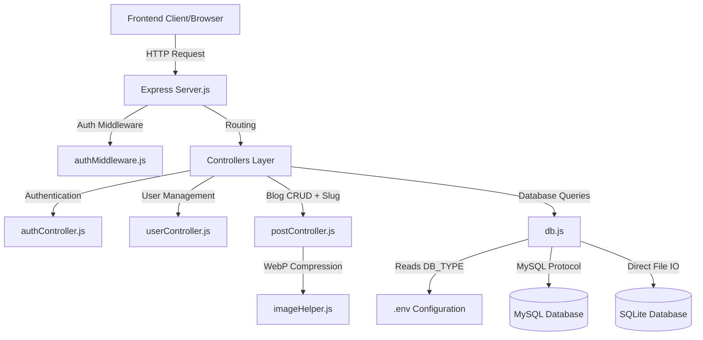

# AI-Optimized Project Documentation: Official Website Integration (OWI)

This document is structured specifically for AI coding assistants to quickly comprehend the codebase, architecture, schema, APIs, and key engineering details of this application.

---

## 🏗️ System Architecture



---

## ⚙️ Environment Variables (`.env`)

```ini
PORT=3000

# Database Configuration
# Supported drivers: "sqlite" or "mysql"
DB_TYPE=mysql

# MySQL Settings (Only active if DB_TYPE=mysql)
DB_HOST=localhost
DB_USER=root
DB_PASSWORD=
DB_NAME=owi_blog

# Google OAuth2 Credentials
GOOGLE_CLIENT_ID=your_google_client_id
GOOGLE_CLIENT_SECRET=your_google_client_secret
GOOGLE_REDIRECT_URI=http://localhost:3000/auth/google/callback
```

---

## 🗃️ Database Layer (`db.js`)

The project uses a unified API to run queries across SQLite and MySQL based on `DB_TYPE`.

### The SQLite Emulation Layer
To avoid writing branch-heavy query code inside controllers, `db.js` wraps the MySQL connection pools with an emulation layer matching the `sqlite3` driver signature:
1. `db.get(query, params, callback)`: Fetches a single row.
2. `db.all(query, params, callback)`: Fetches all matching rows.
3. `db.run(query, params, callback)`: Executes INSERT/UPDATE/DELETE. 
   - Inside the callback context (`this`), the SQLite emulator binds properties:
     - `this.lastID`: Maps to `result.insertId` (MySQL).
     - `this.changes`: Maps to `result.affectedRows` (MySQL).

### Tables & Schema
* **`users`**:
  * `id`: `INTEGER PRIMARY KEY AUTOINCREMENT` (SQLite) / `INT AUTO_INCREMENT PRIMARY KEY` (MySQL).
  * `username`: `VARCHAR(100) UNIQUE`.
  * `api_key`: `VARCHAR(255) UNIQUE`.
  * `google_id`: `VARCHAR(255) NULL`.
  * `email`: `VARCHAR(255) NULL`.
  * `avatar`: `TEXT` (SQLite) / `VARCHAR(255)` (MySQL).
* **`posts`**:
  * `id`: `INTEGER PRIMARY KEY AUTOINCREMENT` (SQLite) / `INT AUTO_INCREMENT PRIMARY KEY` (MySQL).
  * `title`: `VARCHAR(255)`.
  * `content`: `TEXT`.
  * `image`: `VARCHAR(255) NULL`.
  * `slug`: `VARCHAR(255) UNIQUE`.
  * `user_id`: `INTEGER` (SQLite) / `INT` (MySQL) referencing `users(id)`.
  * `created_at`: `TIMESTAMP DEFAULT CURRENT_TIMESTAMP`.
  * `updated_at`: `TIMESTAMP DEFAULT CURRENT_TIMESTAMP` (SQLite has triggers updating it on row mutation; MySQL uses `ON UPDATE CURRENT_TIMESTAMP`).

---

## 🔒 Authentication Flow & Security

### 1. API Key Authentication (`authMiddleware.js`)
Endpoints requiring protection search for a key in:
- Header: `x-api-key`
- Query string: `?api_key=`

If found, it queries `users` and assigns the user object to `req.user`. If invalid or missing, it responds with `401 Unauthorized` or `403 Forbidden`.

### 2. Google OAuth2 Integration (`authController.js`)
* **Crawler Protection**: To prevent automatic web crawlers and scraping bots from triggering Google login loops, **`GET /auth/google` is blocked**. Users must start the login process via a **`POST /auth/google`** request, which responds with a JSON redirect URL:
  ```json
  { "url": "https://accounts.google.com/o/oauth2/v2/auth?..." }
  ```
* **Avatar Retrieval**: Upon successful authentication, the Google User Profile is parsed (including the user's `picture` URL). The avatar image link is stored in `users.avatar`.
* **Login/Redirect Session**: On redirect callback, the server locates the user matching their `google_id`.
  - If existing: Updates `avatar` and `email` properties.
  - If new: Creates a random `api_key` and creates a profile.
  - Redirects the browser to `/?api_key={api_key}`.

---

## ✍️ Blog Post Features & Constraints (`postController.js`)

### 1. Post Slugs
* Generated using `title` mapping alphanumeric chars to lowercase hyphenated paths (e.g. `Judul Post` -> `judul-post`).
* If a duplicate slug is found in the database, `createUniqueSlug` appends a random 4-digit number (e.g. `judul-post-1384`).

### 2. Automated WebP Image Processing (`imageHelper.js`)
* Handled using `multer` and `sharp`.
* When an image is uploaded, it is converted to **WebP format**, resized/compressed to optimize performance, and written to `/uploads/` using a unique filename (`[timestamp].webp`).

### 3. Ownership & Authorization Rules
* Every created post writes `req.user.id` into `posts.user_id`.
* Fetching posts performs a `LEFT JOIN users ON posts.user_id = users.id` to map the owner's username to the field `owned_by`.
* **Otorisasi (Authorization)**: Editing (`PUT /api/posts/:id`) and deleting (`DELETE /api/posts/:id`) enforce:
  ```javascript
  if (row.user_id !== req.user.id) {
      return res.status(403).json({ error: "Anda tidak memiliki akses untuk mengubah/menghapus postingan ini" });
  }
  ```

---

## 🔌 API Endpoints Summary

| Method | Endpoint | Auth | Description |
|---|---|---|---|
| **POST** | `/auth/google` | None | Crawler-safe request to retrieve Google login URL |
| **GET** | `/auth/google/callback` | None | OAuth2 Redirect callback landing page |
| **GET** | `/api/users` | None | Lists seeded/available user keys helper (dev UI) |
| **GET** | `/api/users/me` | API Key | Retrieves current active user profile + avatar URL |
| **GET** | `/api/posts` | API Key | Lists all posts with their owner usernames |
| **GET** | `/api/posts/detail/:slugOrId` | API Key | Fetches single post details by slug or numeric ID |
| **POST**| `/api/posts` | API Key | Creates a new post (handles multipart image upload) |
| **PUT** | `/api/posts/:id` | API Key (Owner) | Updates post fields (checks owner validity) |
| **DELETE**| `/api/posts/:id` | API Key (Owner) | Deletes post & associated storage image (checks owner validity) |
